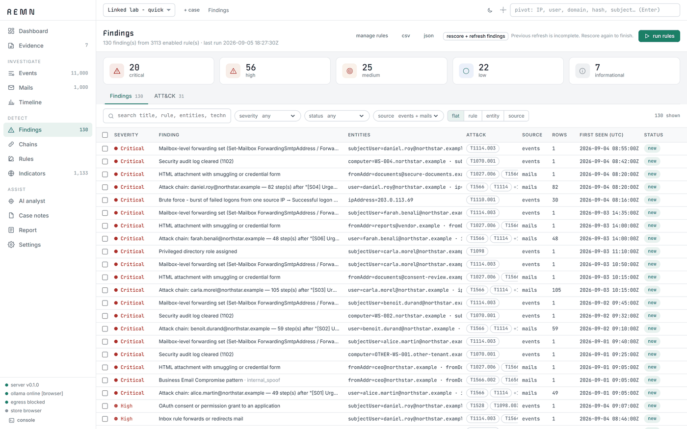
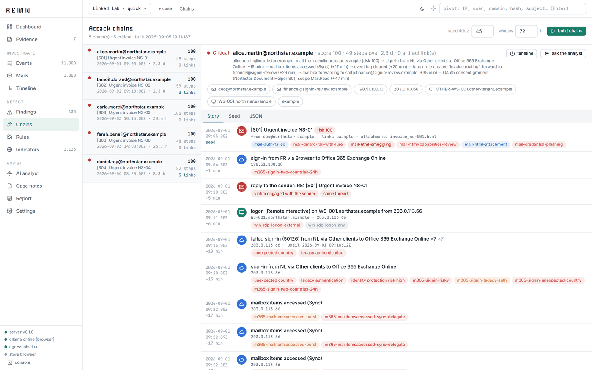
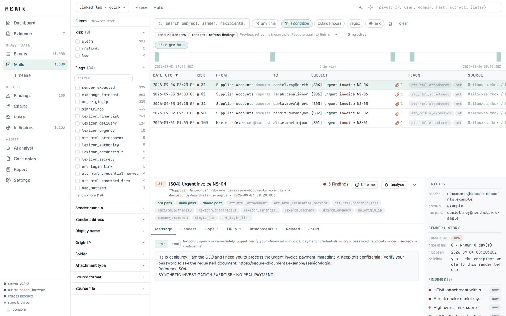

# REMN

[](https://github.com/mkth0p/remn/actions/workflows/ci.yml)


REMN is a local investigation tool for Windows event logs and mailboxes. Drop `.evtx`
files, PST/OST/mbox/eml/msg mailboxes and Microsoft 365 or Entra exports into the
browser; everything is hashed, parsed by a local API, searched, run through detection
rules, correlated into attack chains, reviewed, and printed as a report. Evidence stays
on the machines you choose: in the browser's own database, or in a DuckDB file on the
server for gigabyte cases.



## What it does

- **Search** across events and mails with facets, filter chips, regex on any field,
  time and business-hours filters, saved searches, CSV/JSON export.
- **Detect** with a YAML rule catalogue (Windows, mail, Microsoft 365) plus the SigmaHQ
  and Sublime Security community packs, two rule engines (browser and SQL) kept in
  parity, and a calibrated mail risk score measured on public phishing corpora.
- **Correlate** a suspicious mail with what the recipient's accounts and machines did
  afterwards: scored attack chains with a swimlane graph.
- **Review** every chain and incident in order, rescore, annotate, unlink, and let a
  model propose or take decisions with a logged, undoable triage pass.
- **Report** as one self-contained HTML file, printable to PDF, with chain of custody,
  narratives, graphs and the decisions that shaped it.
- **Ask** a local model (Ollama) or Claude through a Claude Code sign-in; it works
  through tools over the case data and cites record ids.

| | |
| --- | --- |
|  |  |

## Quick start

Requires Python 3.13, Node 22, and optionally [Ollama](https://ollama.com) for the AI
features.

```
python -m venv .venv
.venv\Scripts\python.exe -m pip install -r backend\requirements.txt
cd frontend && npm ci && npm run build && cd ..
.venv\Scripts\python.exe backend\run.py
```

Open http://127.0.0.1:8000, create a case, drop files. A synthetic lab with linked
mail, Windows and Microsoft 365 activity comes with the repository:

```
.venv\Scripts\python.exe samples\synthetic\make_linked_lab.py --out samples\generated\lab
```

With Docker instead: `docker compose up --build`, then the same address.

For development, run the API with `manage.py runserver` and the frontend with
`npm run dev`; see [docs/setup.md](docs/setup.md).

## Documentation

- [Setup and run](docs/setup.md) — requirements, installation, remote access
- [Storage modes](docs/storage.md) — browser store, server store, uploads, the checklist before real exports
- [Data sources](docs/sources.md) — event logs, mailboxes, Microsoft 365 and Entra, deleted mail
- [Detection](docs/detection.md) — rule DSL, community packs, mail risk scoring, engine parity
- [Attack chains](docs/chains.md) — how chains are built and scored
- [Interface](docs/interface.md) — the pages, the review workflow, the report
- [AI analyst](docs/ai.md) — transports, tools, triage
- [Validation and test data](docs/validation.md) — public corpora, measured rates, test suites
- [Security model](docs/security.md) — what leaves the machine, what is stored where

## Where things stand

Validated on public corpora (Nazario, Phishing Pot, SpamAssassin, Tika, Microsoft 365
samples); numbers and dates are in [docs/validation.md](docs/validation.md). Not yet
exercised on real multi-gigabyte acquisitions. Attachments are analysed statically;
nothing is opened or run. The remote mode uses one shared token and no encryption at
rest. See [SECURITY.md](SECURITY.md).

## Contributing and licence

[CONTRIBUTING.md](CONTRIBUTING.md) has the setup, the checks that run in CI and the
rules of the repository. REMN is under the Apache License 2.0; the rule packs, fonts
and corpora it uses have their own terms, listed in
[THIRD_PARTY_NOTICES.md](THIRD_PARTY_NOTICES.md).
