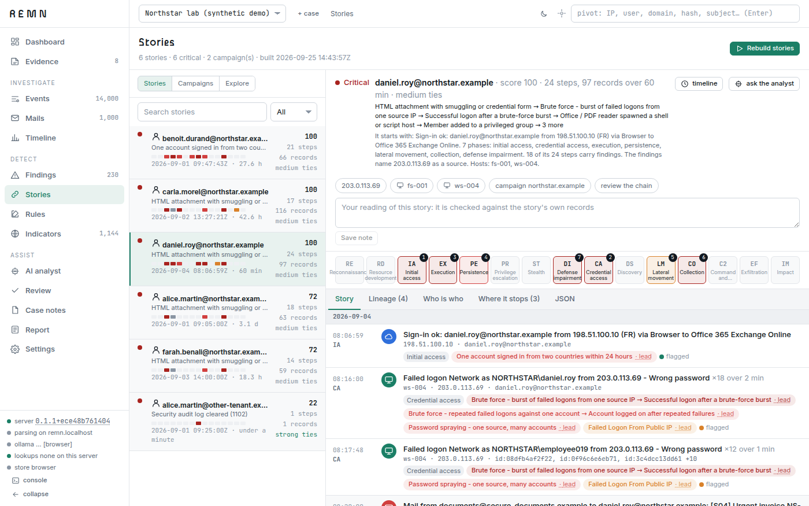

# REMN

[](https://github.com/mkth0p/remn/actions/workflows/ci.yml)


REMN is a local investigation tool for Windows event logs and mailboxes. Drop `.evtx`
files (or event records exported as XML), PST/OST/mbox/eml/msg mailboxes and Microsoft 365
or Entra exports into the browser; everything is hashed, parsed by a local API, searched,
run through detection rules, read into stories, reviewed, and printed as a report.
Evidence stays on the machines you choose: in the browser's own database, or in a DuckDB
file on the server for gigabyte cases. An instance open to the internet runs browser-only:
the server parses each file and keeps none of it.


## What it does

- **Search** across events and mails with facets, filter chips, regex on any field,
  time and business-hours filters, saved searches, CSV/JSON export.
- **Import investigation packages** with mixed mail, EVTX and structured host exports,
  member hashes and explicit coverage; explore the relationship graph of records tied
  across source files through shared digests, files, processes, URLs and accounts.
- **Detect** with a YAML rule catalogue (Windows, mail, Microsoft 365) plus the SigmaHQ
  and Sublime Security community packs, two rule engines (browser and SQL) kept in
  parity, and a calibrated mail risk score measured on public phishing corpora. Every
  event rule is measured on recorded attacks and on clean machines, so a finding says
  whether its rule has been shown to detect what it looks for, or is a lead.
- **Read the case as stories**: one per person or host incident, read along ATT&CK's
  phases, each step saying why it belongs and how surely; the forms one account goes by
  joined with a confidence per join, logon sessions, RDP, admin-share, WMI and WinRM hops
  and process trees drawn from the logs, addresses tied to hosts through DNS and DHCP,
  cloud sign-ins placed on the machine they came from, what each host's evidence cannot
  show, and the campaigns that share an attacker's infrastructure. A phishing mail is
  followed to what its recipient's accounts and machines did afterwards.
- **Review** every chain and incident in order, rescore, annotate, unlink, and let a
  model propose decisions, each applied or dismissed by the analyst.
- **Report** as one self-contained HTML file, printable to PDF, with the stories, chain of
  custody, narratives, graphs and the decisions that shaped it.
- **Investigate with an agent** on a local model (Ollama, LM Studio, llama.cpp, vLLM,
  Jan) or Claude through a Claude Code sign-in: it plans, runs playbooks through read-only
  tools, keeps a hypothesis board and cites the rows it read, checked; every change it
  proposes waits for the analyst's approval, and a hash-chained ledger records its work.

| | |
| --- | --- |
|  |  |

## Quick start

Requires Python 3.13, Node 22, and optionally a local model for the AI features:
[Ollama](https://ollama.com), or LM Studio, a llama.cpp server, vLLM or Jan through their
OpenAI-compatible API.

```
python -m venv .venv
.venv\Scripts\python.exe -m pip install -r backend\requirements.txt
cd frontend && npm ci && npm run build && cd ..
.venv\Scripts\python.exe backend\run.py
```

Open http://127.0.0.1:8000, create a case, drop files, or press "open the demo case" to
see the synthetic lab already read. That lab, with linked mail, Windows and Microsoft 365
activity, comes with the repository:

```
.venv\Scripts\python.exe samples\synthetic\make_linked_lab.py --out samples\generated\lab
```

With Docker instead: `docker compose up --build`, then the same address.

For development, run the API with `manage.py runserver` and the frontend with
`npm run dev`; see [docs/setup.md](docs/setup.md).

## Documentation

- [Setup and run](docs/setup.md) — requirements, installation, remote access
- [Storage modes](docs/storage.md) — browser store, server store, uploads, the checklist before real exports
- [Data sources](docs/sources.md) — event logs, mailboxes, Microsoft 365 and Entra, deleted mail
- [Investigation packages](docs/packages.md) — adapters, coverage, observations and relationships
- [Detection](docs/detection.md) — rule DSL, community packs, mail risk scoring, engine parity
- [Stories](docs/stories.md) — who is who, sessions, hops and process trees, phases, campaigns, where a story stops
- [Attack chains](docs/chains.md) — how chains are built and scored
- [Interface](docs/interface.md) — the pages, the review workflow, the report
- [AI analyst](docs/ai.md) — the investigating agent, playbooks, approval inbox, AI ledger, transports
- [Validation and test data](docs/validation.md) — public corpora, measured rates, test suites
- [Optional archive honeypot](docs/honeypot.md) — isolated decoy, reference trail, private replay and REMN package export
- [Security model](docs/security.md) — what leaves the machine, what is stored where

## Where things stand

Mail scoring is validated on public corpora (Nazario, Phishing Pot, SpamAssassin, Tika,
Microsoft 365 samples), and Windows detection on recorded attacks, including two libraries
the rules were not written for: on EVTX-to-MITRE-Attack, REMN detected 109 of 279 at medium
level and above where Hayabusa detected 86 and Chainsaw 52 (25 September 2026), and on the
Windows datasets of Splunk attack_data it detects 227 of 535 (42%). On seven clean
Windows machines its own rules raise 200 high and critical findings, and a weekly job
fails when a rule stops detecting a recording or a high one gets noisier. Numbers, dates
and method are in [docs/validation.md](docs/validation.md) and [docs/reviews/](docs/reviews/).
Not yet exercised on real multi-gigabyte acquisitions. Attachments are analysed statically;
nothing is opened or run. The remote mode uses one shared token and no encryption at
rest. See [SECURITY.md](SECURITY.md).

## Contributing and licence

[CONTRIBUTING.md](CONTRIBUTING.md) has the setup, the checks that run in CI and the
rules of the repository. REMN is under the Apache License 2.0; the rule packs, fonts
and corpora it uses have their own terms, listed in
[THIRD_PARTY_NOTICES.md](THIRD_PARTY_NOTICES.md).
