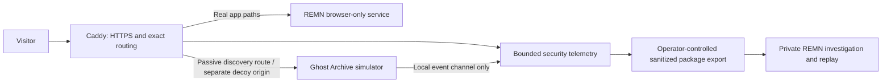

# REMN: The Ghost Archive

Design proposal, 9 September 2026. No live infrastructure changes.

Implementation added 10 September: see [deployment and operator guide](honeypot.md).
The implemented service uses standard-library Python and a Unix socket with
container networking disabled. Its offline replay records actions and response
digests, without storing exact response bodies or signed handles. This proposal
describes the original scope; the implementation guide records current limits.

**Someone investigating a supposedly abandoned case archive unwittingly creates
another case: a precise record of their own interaction with the archive.**

The public-facing fiction is **Records Continuity Service**, a maintained legacy
system carrying the unfinished obligations of a closed office. Its atmosphere is
quiet, administrative and increasingly liminal. See the companion
[narrative and interaction specification](ghost-archive-narrative.md) for the
revised experience, exact copy and coherent institutional mystery.

This combines a defensive deception service, an operator replay and an optional
forensic investigation challenge. Its distinctive feature is how it uses REMN's package,
provenance, relationship and timeline workflows. The detection value is measurable
use of planted information, not a promise to fool every attacker or identify a person.

## Fit with the current project

The public Compose profile uses Caddy and `FORENSIC_BROWSER_ONLY=1`. It closes
server case stores, jobs, chunked uploads and server-side models. Parsing and
correlation still execute on the server, with temporary access to uploaded evidence.
Browser-only therefore does not mean a static site with no server attack surface.

A separate, allegedly retired server archive is plausible bait. Real API paths
must retain their existing behavior: a call to `/api/store` is not by itself an
attack and should continue to get the browser-only denial. All lure URLs below
are proposed decoy routes, not statements about files currently exposed.

## The experience

1. **The apparent migration defect.** A small, explicitly planted route such as
   `/.env.bak` returns a passive fragment referencing a retention compatibility
   manifest. A retained build artifact offers an independent entry. The opening
   contains routine technical metadata; the real UI never loads the decoy.
2. **The surviving reference.** An object withdrawn from a replacement index still
   resolves through a specific legacy reference inside the isolated simulator.
   Comparing manifests reveals equal payload hashes but different custody states.
   Separate schema and transfer documents lead to an office called Annex C. This
   apparent finding motivates the investigation before the institutional fiction
   becomes recognizable.
3. **The vacant position.** Planted credentials and reference handles gradually
   supply a delegation, scope schedule and receipt authority. These grant simulated
   archive capabilities associated with a vacant custodian role. The system assigns
   requests to a workflow, without claiming to know who is making them. No real
   account, obligation, privilege or cloud key exists.
4. **The case opens another case.** As the visitor explores, the operator's private
   view assembles exhibits: discovery, credential reuse, record access, recovery
   request and export request. Each connection cites the marker that explains it.
5. **The current receipt.** A retrieval receipt appears among the supporting
   records of the old case. It accurately describes this episode's decoy requests,
   without personal information. An optional, plainly labelled challenge can then
   let a consenting visitor reconcile the fictional office's circular custody chain.
   Quiet deployments end with a bounded read-only state and no theatrical reveal.

Example sequence:

```text
10:42:01  Configuration fragment requested      Exhibit A issued
10:42:06  Its archive token used                A → delegation
10:42:10  A case-only manifest retrieved         Delegation → custody index
10:42:18  Its recovery clue used                 Manifest → receipt authority
10:42:27  A synthetic export requested           Receipt → reference copy
```

These are observed actions. “Human”, “malicious”, “same person” and “successful
compromise” are not conclusions established by this sequence.

## Three signature mechanics

### A world that remembers clues

A random episode ID selects a deterministic scenario from reviewed templates.
Each issued credential, manifest handle and download handle carries a signed,
purpose-bound marker: episode, parent exhibit, allowed decoy action and expiry.
The server reconstructs the fictional world cheaply, without an LLM, real SQL,
shell commands or a database of fake customers.

The narrative is distributed across a bounded document graph: technical migration
records, administrative transfers and evidentiary receipts corroborate one another.
Allow multiple reading orders, consistent ordinary dead ends and narrow synthetic
access scopes. Each reference must have a reason to exist in its containing artifact.
The obscure ARG treatment is specified in `ghost-archive-narrative.md`.

Markers distinguish a generic scan from use of information found in earlier bait.
They also connect possession of the same clue across IP changes. That establishes
information lineage, not identity: links may be shared, crawled, forwarded or replayed.
An expired marker cannot advance the story. A decoy credential is never accepted
by production, by an operator interface or by an external service.

### A replay worth watching

The operator gets a compact evidence-board replay: a cursor travels from the
discovery route through transfers, delegations and receipts, leaving cited exhibits.
Scrubbing pauses on exactly what was served and which marker was subsequently used.
Use ordinary section names such as **Transfers**, **Delegations** and **Current
Receipt**, alongside precise labels such as “token reused” and “export requested”.

Rank episodes by demonstrated depth and useful new transitions, not request volume,
claimed attacker sophistication or countries. Keep the operator view private and
read-only over sanitized telemetry. Do not expose a public IP or payload leaderboard.

### An investigation after explicit opt-in

Opt-in challenge mode turns the mechanism into a product demonstration. A player
resolves a bounded forensic mystery using custody references, matching file hashes
and an overlooked scope amendment. The satisfaction comes from making the documents
agree. Completion produces an understated disposition receipt and a sanitized REMN
case package. There are no trophies, timed threats, jump scares or pressure to continue.

Challenge episodes use separate signed scopes and are excluded from unsolicited
deception alert counts. A client-supplied header cannot relabel production activity
as a challenge. Visitor replays expose neither IPs nor another episode's telemetry,
operator detection thresholds, production logs or real case material.

## Architecture and boundaries



Start with `vault.remn.tech` as a distinct origin if staying within the existing
domain. A separate registrable domain provides stronger site separation when one
is available. A subdomain is a different origin but can still be the same site:
do not rely on SameSite cookies alone. Browser storage is separated by origin.
[Browser same-origin rules](https://developer.mozilla.org/en-US/docs/Web/Security/Defenses/Same-origin_policy).

The real-origin discovery response is text only, with a closed CSP. All decoy
responses have edge-enforced headers, no caching of episode-specific content, no
reflection of unescaped input and no ability to set parent-domain cookies. Any
challenge UI lives on the decoy origin; the operator replay consumes sanitized
data inside a private investigation. A directory under the real app origin is
not sufficient isolation for an executable decoy UI.

Run the simulator as an unprivileged, read-only service with no REMN imports,
evidence volumes, Docker socket, SSH material, cloud credentials or host namespaces.
Its network policy permits replies to the proxy but denies new outbound connections,
including to the proxy itself, the app, host gateway, DNS and cloud metadata. An
internal Docker network alone is not this policy; verify host-enforced restrictions.
Containers on one VM still share a kernel. A separate VM is the stronger boundary
if the deployment later needs higher-interaction deception.

Explicitly deny the decoy access to OCI's `169.254.169.254` metadata endpoint; IMDSv2's
required header is not a substitute for denying network access from an untrusted
service. [OCI metadata documentation](https://docs.oracle.com/en-us/iaas/Content/Compute/Tasks/gettingmetadata.htm).

Do not route arbitrary production requests into the simulator because of an IP score.
Only designated decoy routes and valid decoy markers enter it. An ordinary visitor,
shared office IP or someone importing suspicious evidence must keep normal REMN behavior.
No callbacks inside genuine evidence, browser fingerprinting, retaliation or remote
execution is part of this design.

## Cheap operation and meaningful telemetry

Initial **targets to benchmark**, not measured results:

| Budget | Proposed starting value |
|---|---|
| Simulator | One small Go binary, ARM64 and x86-64 builds |
| Resource ceiling | 128 MiB RAM; up to 0.1 CPU on the smallest shape, 0.25 on A1 |
| Work | Maximum 16 concurrent decoy requests; bounded queue; excess gets a cheap 429 |
| Payload | 8 KiB accepted request body, 32 KiB normal response, 128 KiB synthetic export |
| Lifetime | 24-hour markers; at most 8 meaningful narrative transitions |
| Logging | 64 MiB rotating local ring, maximum 7-day retention; aggregate repetition |
| Failure | Exact decoy routes return a small error; real app routing continues independently |

No endless archive, sleep-based tarpit, zip bomb, live generative model or expensive
decompression runs in the decoy. Use global admission limits as well as client/episode
limits so rotating source addresses cannot bypass the machine's total work budget.
Enforce and test CPU/memory constraints on the actual host; Docker containers have
no resource limits by default. [Docker resource constraints](https://docs.docker.com/engine/containers/resource_constraints/).

Oracle's current documentation lists A1 Always Free at the equivalent of 2 OCPUs and
12 GB, while the E2 micro has 1 GB and a fractional OCPU. Confirm the actual instance
and tenancy; the design must not assume the older 4-OCPU allocation.
[Oracle Always Free resources](https://docs.oracle.com/en-us/iaas/Content/FreeTier/freetier_topic-Always_Free_Resources.htm).

Keep an event's timestamp, trusted request ID, route template, marker IDs, action,
result, timing and byte counts. Default to short-lived keyed IP pseudonyms; make
temporary raw-IP retention an explicit operational choice. Do not retain real
upload bodies, arbitrary passwords, authorization headers or unrestricted query
strings. Sanitize control characters and cap every recorded field. Security
telemetry retention must be accurately disclosed separately from case storage.
[OWASP logging guidance](https://cheatsheetseries.owasp.org/cheatsheets/Logging_Cheat_Sheet.html).

The current app trusts the first forwarded address when proxy trust is enabled.
Caddy must be the only ingress, or have correctly scoped upstream proxy trust if
a CDN is later added. Arbitrary forwarded headers must never establish an episode's
source address. [Caddy proxy header behavior](https://caddyserver.com/docs/caddyfile/directives/reverse_proxy#defaults).

Record discovery-only activity quietly. Raise an investigation lead on valid marker
reuse and on distinct multi-step transitions, while recognizing authorized researchers
and capable crawlers can do this too. Never automatically label or permanently ban
a person. Preserve high-value transitions ahead of repeated probes when the log ring
fills, and expose dropped-event counters. A log hash chain can reveal alterations
relative to a separately saved checkpoint; a local chain alone is not tamper-proof.

## Implementation sequence and acceptance gates

1. **Isolated sensor:** exact proxy routes, small deterministic simulator, signed
   markers, resource limits and bounded telemetry. No public challenge initially.
2. **Ghost case export:** a dedicated deception-event adapter for REMN packages,
   preserving event times, synthetic-artifact hashes and marker relationships.
   This adapter still needs implementation; it is not an existing artifact category.
3. **Private replay:** episode graph, chapter transitions and evidence-backed notes.
4. **Optional challenge:** explicit opt-in, finite puzzles, sanitized personal replay.

| Boundary or claim | Required proof before deployment |
|---|---|
| Production stays intact | Normal imports, reports and browser-only denials behave identically with the decoy enabled and disabled. |
| Origins remain isolated | Hostile decoy content cannot access production IndexedDB, set parent cookies or issue privileged cross-origin calls. |
| The service cannot pivot | Tests deny decoy-initiated access to app, proxy, host gateway, IPv4/IPv6 private destinations, metadata and internet; legitimate replies still work. |
| Credentials are fictional | Issued markers fail against all real endpoints; tampered, expired and wrong-purpose markers cannot advance a decoy action. |
| Correlation is honest | Shared IPs do not merge independent episodes; shared markers are labelled possession links, not personal attribution. |
| It survives a flood | A fixed synthetic load cannot exceed resource/log caps; decoy overload does not consume the real parser's worker pool. |
| Telemetry respects evidence | Canary credentials and hostile strings are tested for redaction, log injection, CSV injection and unsafe rendering; real uploads never enter these logs. |
| The game does not inflate alerts | Only server-issued challenge scopes suppress challenge alerts, and only inside decoy routes. |

The first deliverable should be the sensor and one complete, believable case. Expand
only when replayed episodes show which clues actually lead to useful observations.
